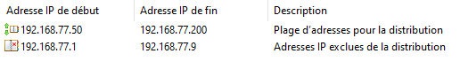

# Powershell_dns_dhcp
mise en place du DNS 

tout d'abord il faut l'installer afin de pouvoir y appliquer par la suite les configurations nécessaires.

Une fois installé nous pouvons commencer la configuration de celui ci. 
On crée la zone primaire DNS qui sera nommé "entreprisexyz.local".

Une fois cela fait on ajoute un enregistrement Hote(A) avec comme nom srv-dc1 et avec l'adresse IP 192.168.77.3 .

Pour finir la configuration on mets un redirecteur de DNS vers les serveur de google.

Question1:
Il relie directement un domaine à une adresse IPv4, permettant aux navigateurs d'accéder directement au serveur. Alors que CNAME sert d'alias pour un domaine ou un sous-domaine, pointant vers un autre nom de domaine. Par exemple, blog.example.com pourrait être associé à example.com. 

Question2:
Get-Dhcpserverv4lease

Question 3:
Un redirecteur DNS (ou forwarder) est un serveur ou une configuration DNS qui permet de transmettre les requêtes que le serveur local ne peut pas résoudre vers un autre serveur DNS, généralement plus autoritaire ou spécialisé.

Mise en place DHCP

Tout d'abord nous avons installé DHCP

Ensuite il faut crée son étendu DHCP sous le nom de "LAN_EntrepriseXYZ"

il faut par la suite lui donner une plage d'adresse IP.

aussi il faut configurer les options DHCP

et enfin il faut crée une réservation d'adresse IP pour un service en particulier

Question 1:
L'IP dynamique permet d'attribuée automatiquement, susceptible de changer, adaptée aux appareils mobiles ou temporaires alors que la Réservation DHCP donne une adresse fixe assignée par le DHCP selon l’adresse MAC de l’appareil, adaptée aux périphériques nécessitant une IP constante.

Question2:
Deux serveurs DHCP peuvent coexister sur le même réseau. Le risque dépend de l’organisation des plages d’adresses et de la synchronisation des baux avec un basculement DHCP configuré, la cohabitation devient sûre et fiable, permettant équilibrage de charge ou redondance.

Question3:
Get-DhcpServerv4Lease -ComputerName "NomDuServeurDHCP" -ScopeId 192.168.1.0